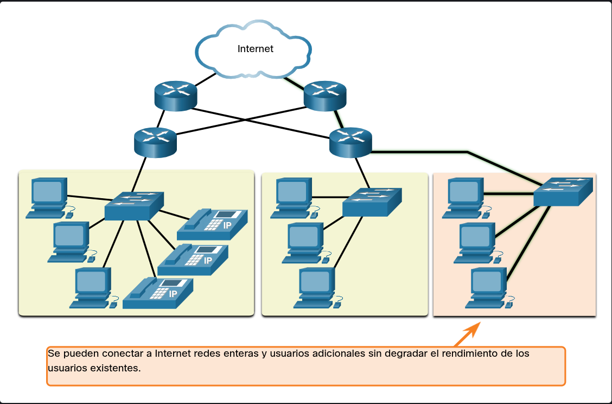

**Arquitectura de Red:** Se refiere a las tecnologías, servicios, reglas y protocolos que permiten que los datos se trasladen a través de la infraestructura física de la red. Para que una red sea confiable y cumpla con las expectativas del usuario, debe abordar cuatro características básicas:

 **Tolerancia a fallas:** Capacidad de la red para seguir funcionando aunque falle algún componente.

 **Escalabilidad:** Capacidad de crecer rápidamente para admitir nuevos usuarios y aplicaciones sin afectar el rendimiento.

 **Calidad de servicio (QoS):** Mecanismo para administrar el tráfico y asegurar que las aplicaciones críticas (como video o voz) tengan la prioridad necesaria.

.png)

**Seguridad:** Protección de la infraestructura y de los datos que viajan por ella contra accesos no autorizados.

