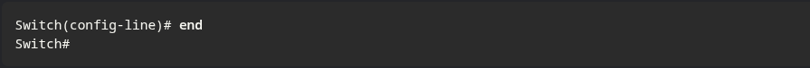

Cisco IOS divide el acceso en dos niveles de seguridad: el **Modo EXEC de usuario**, que solo permite tareas básicas de monitoreo y se identifica con el símbolo **`>`**, y el **Modo EXEC privilegiado**, que da acceso total a todas las funciones y configuraciones del equipo, reconociéndose por el símbolo **`#`**. El primero es principalmente de "solo visualización", mientras que el segundo es obligatorio para realizar cualquier cambio administrativo en el router o switch.

**MODOS DE CONFIG Y SUBCONFIG.**

| **Modo de Comando**           | **Propósito**                                                    | **Indicador (Prompt)** |
| ----------------------------- | ---------------------------------------------------------------- | ---------------------- |
| **Configuración Global**      | Realizar cambios que afectan la operación total del dispositivo. | `Switch(config)#`      |
| **Configuración de Líneas**   | Configurar el acceso (Consola, SSH, Telnet o Auxiliar).          | `Switch(config-line)#` |
| **Configuración de Interfaz** | Configurar un puerto de switch o una interfaz de red específica. | `Switch(config-if)#`   |

