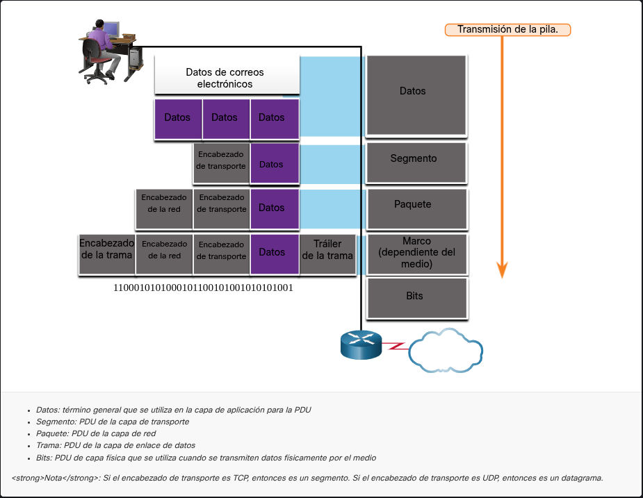

## Segmentación del mensaje.

La segmentación es el proceso de dividir un mensaje grande en partes pequeñas llamadas **paquetes** para enviarlos por la red.

En vez de mandar toda la información de una sola vez, los datos se separan en pequeños bloques. Así, cada paquete puede viajar por diferentes rutas hasta llegar al destino, donde se vuelven a unir.

### ¿Por qué se hace esto?

**Más velocidad:**  La red puede enviar muchos paquetes de diferentes usuarios al mismo tiempo bloquearse.

**Más eficiencia:**  Si un paquete se pierde o falla, solo se vuelve a enviar ese paquete y no todo el mensaje completo.

### Ejemplo simple

Es como enviar un libro página por página en varios sobres, en lugar de meterlo todo en un solo paquete gigante.

---
### La secuenciación:

 La **secuenciación** es como ponerle números de página a un mensaje dividido en partes; al usar segmentación, los trozos pueden llegar desordenados o por rutas distintas, por lo que el protocolo **TCP** les asigna un número de orden a cada uno. Esto permite que, al llegar al destino, el receptor pueda rearmar la información exactamente como era originalmente, evitando que el mensaje final sea un caos sin sentido.

### Unidades de datos de protocolo:

La **PDU (Unidad de Datos de Protocolo)** es el nombre genérico que recibe la información mientras viaja por las capas de red; a medida que baja por estas capas, se le añade información adicional de control en un proceso llamado **encapsulamiento**. Básicamente, cada capa envuelve los datos en un "sobre" nuevo y le cambia el nombre a esa PDU (como paquete o segmento) para indicar en qué etapa del proceso se encuentra.

