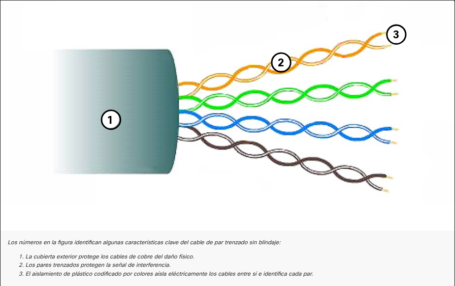
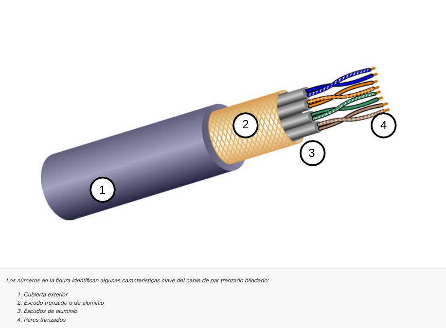

---

### El Cableado de Cobre

Es el medio más utilizado por ser económico, fácil de instalar y tener baja resistencia eléctrica. Sin embargo, tiene dos grandes limitaciones: la **distancia** (la señal se debilita o "atena" mientras más viaja) y las **interferencias**.

**Enemigos de la señal de cobre**

| **Problema**   | **Descripción**                                                           | **Solución**                                        |
| -------------- | ------------------------------------------------------------------------- | --------------------------------------------------- |
| **EMI / RFI**  | Distorsión causada por ondas de radio, luces fluorescentes o motores.     | Blindaje metálico y conexión a tierra.              |
| **Crosstalk**  | Interferencia entre hilos adyacentes (un cable "pisa" la señal del otro). | Trenzado de pares de cables para cancelar el ruido. |
| **Atenuación** | Deterioro de la señal eléctrica a mayor distancia.                        | Respetar los límites de longitud de los estándares. |

**TIPOS DE CABLEADO DE RED**

**PAR TRENZADO NO BLINDADO UTP**

El **UTP (Par trenzado no blindado)** es el cable de red más utilizado para conectar dispositivos en una LAN mediante conectores RJ-45. Está compuesto por cuatro pares de hilos de cobre trenzados entre sí y codificados por colores; este trenzado es clave, ya que cancela las interferencias electromagnéticas internas sin necesidad de un blindaje metálico pesado.

**PAR TRENZADO BLINDADO STP**

El **STP (Par trenzado blindado)** es la versión reforzada del UTP. Utiliza blindaje metálico para proteger los datos contra interferencias externas (EMI/RFI) y el trenzado para el crosstalk. Es más caro y difícil de instalar, ya que requiere conectores blindados y una **conexión a tierra obligatoria**; de lo contrario, el blindaje actúa como antena y empeora la señal.

**CABLEADO CAOXIAL**

El **cable coaxial** utiliza un conductor de cobre central rodeado por una capa de aislamiento flexible, una malla metálica que actúa como segundo conductor y escudo contra interferencias, y una cubierta exterior protectora. Aunque ha sido reemplazado en muchas LAN por el cable de par trenzado, sigue siendo fundamental para instalaciones de internet por cable (módem), sistemas de televisión y para conectar antenas en redes inalámbricas.

