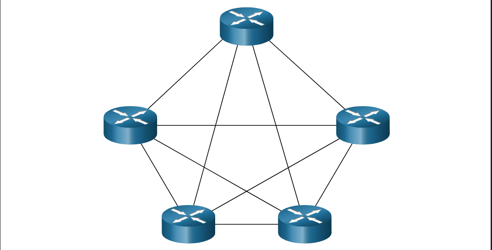

---

### Topologías Físicas y Lógicas

---

**1. Topología Física (Physical Topology):** Muestra las conexiones físicas reales de la infraestructura. Identifica exactamente cómo están interconectados los cables y los dispositivos (finales e intermediarios). Incluye datos de ubicación geográfica muy específicos, como el número de aula u oficina, números de puertos físicos y la posición exacta de los equipos en los racks de telecomunicaciones.

---

**2. Topología Lógica (Logical Topology):** Representa la ruta virtual por la que viajan los datos a través de la red. Describe cómo la Capa 2 transfiere las tramas de un nodo al siguiente. En lugar de ubicaciones físicas o cables, este diagrama muestra los nombres de las interfaces de los dispositivos (ej. _GigabitEthernet0/0_) y los esquemas de direccionamiento IP (Capa 3). Es la que determina directamente el método de control de acceso a los medios.

---

**Topologías WAN**

1.**Punto a Punto:** Esta es la más simple de todas y consiste en un enlace permanente entre 2 dispositivos finales. 

2.**Centro y Redios:** Esta describe una topología o modelo organizativo que centraliza las operaciones, rutas o datos en un punto principal (_hub_) desde el cual se ramifican conexiones hacia puntos secundarios (_spokes_ o radios). 

3.**Malla**: La topología de malla es una configuración de red donde los dispositivos (nodos) están interconectados entre sí, permitiendo múltiples rutas para que los datos viajen. Ofrece alta redundancia y tolerancia a fallos: si un cable o nodo se rompe, la información se redirige automáticamente por otra ruta disponible.

---

**TOPOLOGÍA WAN PUNTO A PUNTO:** 

| **Concepto / Variación**  | **Comportamiento en Capa 2**                                        | **Nota de Examen 📝**                                                            |
| ------------------------- | ------------------------------------------------------------------- | -------------------------------------------------------------------------------- |
| **Conexión Serial (PPP)** | Pone la trama en el medio y el otro extremo la recibe directamente. | **No** revisa si la dirección de destino le pertenece (es el único en el cable). |
| **Conexión Ethernet**     | Conexión directa entre dos nodos usando tecnología LAN.             | **Sí** está obligado a validar si la trama entrante es para él.                  |
| **Topología Física**      | El enlace cruza múltiples routers, switches y distancias reales.    | Muestra la infraestructura y equipos reales en la nube.                          |
| **Topología Lógica**      | Ignora los equipos del medio; solo ve dos nodos interconectados.    | Se mantiene idéntica y directa sin importar el hardware real.                    |

---
### Topologías LAN

En las redes de área local (LAN) de acceso múltiple, los dispositivos finales se interconectan utilizando principalmente dos tipos de estructuras jerárquicas:

####  Topologías Modernas

**Estrella (Star):** Los dispositivos finales se conectan directamente a un dispositivo intermediario central. En las redes actuales, este dispositivo es un **switch Ethernet** (en las primeras redes de este tipo se utilizaban _hubs_).

**Estrella Extendida (Extended Star):** Es una evolución de la topología en estrella donde se interconectan múltiples switches Ethernet entre sí, ampliando el alcance de la red.

**Ventajas principales:**  Fáciles de instalar.

Altamente escalables (es muy simple añadir o retirar nodos).

Facilidad para la resolución de problemas (_troubleshooting_).

> **Nota sobre Ethernet Punto a Punto:** Aunque Ethernet está diseñado para acceso múltiple, si la LAN se limita a conectar únicamente dos dispositivos entre sí (por ejemplo, dos routers conectados directamente por sus interfaces Ethernet), se considera un ejemplo de Ethernet operando en una **topología punto a punto**.

---

#### Topologías LAN Legadas (Legacy)

Las tecnologías antiguas de Ethernet y Token Ring utilizaban infraestructuras físicas distintas que ya no se despliegan en redes modernas:

**Bus:** Todos los sistemas finales se encadenan en serie uno tras otro a lo largo de un único cable.

**Características:** Requiere un **terminador** en cada extremo del circuito físico. No utiliza dispositivos intermediarios como switches o hubs. Era común en las primeras redes Ethernet usando cable coaxial debido a que era económico y fácil de montar.

**Anillo (Ring):** Los sistemas se conectan exclusivamente con sus vecinos adyacentes de la izquierda y la derecha, cerrando un círculo o anillo de datos.

**Características:** A diferencia de la topología en bus, **no requiere terminadores** en sus extremos. Fue el estándar utilizado por las tecnologías legadas **Token Ring** y **FDDI** (_Fiber Distributed Data Interface_).

---

### Comunicación Half y Full Duplex

El modo dúplex define la **dirección y simultaneidad** de la transmisión de datos entre dos dispositivos en la red. Es un factor crítico al analizar el rendimiento y las colisiones en las topologías LAN.

### Comunicación Half-Duplex (Medio Dúplex)

**Definición:** Ambos dispositivos pueden transmitir y recibir datos a través del medio, pero **NO al mismo tiempo**.

**Mecánica:** Funciona como un _walkie-talkie_. Si un dispositivo está transmitiendo, el otro debe esperar a que el canal quede libre. Solo se permite un flujo unidireccional a la vez en el medio compartido.

**Tecnologías que lo usan:**

 **WLANs** (Redes inalámbricas / Wi-Fi).
 
Topologías legadas en **Bus**.

Redes antiguas interconectadas por **Hubs Ethernet**.

---

### Comunicación Full-Duplex (Dúplex Completo)

**Definición:** Ambos dispositivos pueden transmitir y recibir datos de forma **simultánea**.

**Mecánica:** El canal físico se divide o cuenta con hilos dedicados para enviar y recibir de manera independiente. No existe competencia por el medio, por lo que **no hay peligro de colisiones**.

**Tecnologías que lo usan:** Conexiones modernas switch a switch o switch a host utilizando **switches Ethernet**.

---

---

### Métodos de Control de Acceso

Las redes de acceso múltiple (como las LAN Ethernet y las WLAN) son aquellas en las que **dos o más dispositivos finales compiten por acceder al mismo medio físico simultáneamente**. Para evitar el caos, existen reglas que gobiernan cómo se comparte el canal.

Hay dos métodos básicos de control de acceso al medio compartido:

1.**Acceso basado en contención (Contention-based access)**

2.**Acceso controlado (Controlled access)**

### Acceso Basado en Contención

En este método, todos los nodos operan en **half-duplex**, lo que significa que compiten activamente por el uso del canal. Como **solo un dispositivo puede transmitir a la vez**, se requieren procesos específicos para gestionar la comunicación y resolver los problemas cuando dos o más dispositivos transmiten al mismo tiempo.

Los dos mecanismos de contención más importantes en exámenes de certificación son:

**CSMA/CD (Carrier Sense Multiple Access with Collision Detection):**

**Función:** Detección de colisiones. El dispositivo escucha el medio; si está libre, transmite. Si dos dispositivos transmiten a la vez, se produce una colisión, la detectan, detienen la transmisión y esperan un tiempo aleatorio para reintentar.

**Uso:** Redes LAN Ethernet legadas (con topología en bus o usando hubs).
  
**CSMA/CA (Carrier Sense Multiple Access with Collision Avoidance):**

**Función:** Prevención de colisiones. El dispositivo examina el medio para ver si está libre; si lo está, envía una notificación de su intención de transmitir antes de enviar los datos reales para evitar que otros transmitan.

**Uso:** Redes LAN inalámbricas (WLAN / Wi-Fi).

El método **CSMA/CA** es el protocolo de control de acceso exclusivo para redes inalámbricas (**WLAN/Wi-Fi**), diseñado específicamente para **evitar** colisiones en el aire, ya que las antenas no pueden detectar interferencias mientras transmiten; en contraste, **CSMA/CD** se utiliza únicamente en redes cableadas compartidas (**Ethernet legado** con hubs o buses) para **detectar** colisiones en el cobre una vez que ocurren, deteniendo el tráfico de inmediato para retransmitir tras un tiempo aleatorio.

**NOTA:** Hoy en día, las redes usan full-duplex y no requieren un metodo de acceso.

---

El **Acceso Controlado** es un método antiguo y determinista (como _Token Ring_) donde cada dispositivo tiene un turno estricto para transmitir. Es muy **ineficiente** porque obliga a los equipos a esperar su turno de forma obligatoria, incluso si nadie más está usando la red, evitando que se produzcan colisiones pero ralentizando el tráfico.

Por el contrario, el **Acceso por Contención (CSMA/CD)** permite que los dispositivos transmitan en modo _half-duplex_ cuando consideren que el cable está libre. Si dos nodos transmiten a la vez, las señales chocan elevando el voltaje eléctrico; la tarjeta de red (NIC) detecta este **pico de amplitud**, descarta los datos dañados y obliga a los dispositivos a esperar un tiempo aleatorio antes de volver a intentar.

---

### Acceso por Contención: CSMA/CA

El método **CSMA/CA** se utiliza en redes inalámbricas (**IEEE 802.11 WLANs**) porque en el aire los dispositivos no pueden detectar colisiones mientras transmiten. En lugar de reaccionar a los choques, se enfoca en **evitarlos** mediante dos estrategias clave:

**Anuncio de Duración:** Cada dispositivo que transmite incluye en su trama el **tiempo exacto** que necesitará para completar la transmisión. Todos los demás dispositivos de la zona reciben esta información y saben exactamente cuánto tiempo el medio estará ocupado, absteniéndose de transmitir durante ese periodo.

**Acuse de Recibo (ACK):** Al finalizar la transmisión de una trama 802.11, el receptor responde de inmediato con un mensaje de confirmación (**Acknowledgment**). Si el emisor no recibe este ACK, asume que hubo interferencia o una colisión y vuelve a programar el envío.

Algunas de las limitaciones que puede presentar este metodo de contensión es que tanto en redes cableadas con hubs (CSMA/CD) como en redes inalámbricas (CSMA/CA), **el rendimiento no escala bien bajo un uso intenso del medio**. Si se conectan demasiados dispositivos compitiendo a la vez, las colisiones y las esperas aumentan de forma drástica, haciendo que la red se vuelva extremadamente lenta.

**NOTA:** *Las redes LAN Ethernet modernas que utilizan **switches** no sufren este problema ni usan sistemas basados en contención, ya que el switch y las tarjetas de red (NIC) operan en modo **full-duplex**, contando con canales dedicados bidireccionales libres de colisiones.*

---

