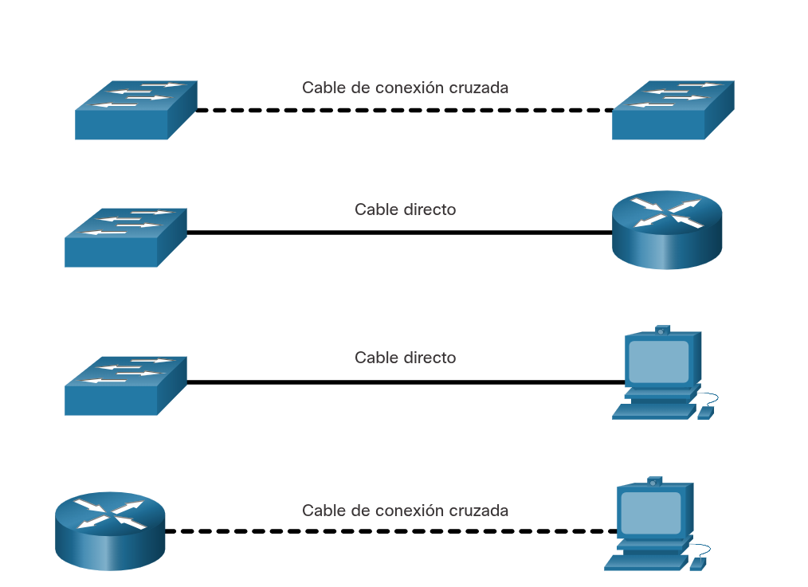

---

### Métodos de Reenvío de Tramas en Switches Cisco

Los switches de Cisco utilizan dos métodos de hardware para conmutar y enviar datos entre los puertos de una red, cada uno optimizado para priorizar la integridad o la velocidad:

**Store-and-Forward (Almacenamiento y Envío):** El switch recibe la trama **completa** en sus buffers antes de tomar una decisión. Lee los datos, calcula el código matemático **CRC** y verifica que la trama no tenga errores físicos. Si la verificación es válida, busca la MAC de destino en su tabla y reenvía el paquete por el puerto de salida.

**Cut-Through (Método de Corte):** El switch actúa de forma inmediata. No espera a recibir la trama completa; tan pronto como se leen los primeros bits que contienen la **dirección MAC de destino** (al inicio del encabezado), el switch empieza a reenviar la trama hacia el puerto de salida sin verificar los errores.

### Variantes del Cut-Through Switching

**Fast-Forward (Reenvío Rápido):** Ofrece la **latencia más baja**. Transmite la trama inmediatamente después de leer los 6 bytes de la dirección MAC de destino. No filtra errores, por lo que puede propagar paquetes corruptos que luego la NIC de destino descartará.

**Fragment-Free (Libre de Fragmentos):** Almacena y lee estrictamente los **primeros 64 bytes** de la trama antes de reenviar. Es el punto medio entre velocidad e integridad, diseñado para detectar y filtrar fragmentos de colisión (_runt frames_), ya que la mayoría de los errores ocurren en ese primer bloque.

---

**Almacenamiento de búfer de memoria de los swithes**

Un switch ethernet  puede usar una técnica de almacenamiento en búfer para almacenar tramas antes de enviarlas. También se puede utilizar el almacenamiento en búfer cuando el puerto de destino está ocupado debido a la gestión. El switch almacena la trama hasta que se pueda transmitir.

---

**Búfer de Memoria Compartida:** Permite almacenar tramas más grandes y dinámicas en un pozo de memoria común para todos los puertos, reduciendo drásticamente la cantidad de tramas descartadas por falta de espacio.

**Conmutación Asimétrica:** Es la capacidad del switch de manejar **diferentes velocidades de datos en sus puertos** (por ejemplo, conectar un servidor a un puerto de **10 Gbps** y las PCs a puertos de **1 Gbps**). La memoria compartida es clave aquí para amortiguar la diferencia de velocidad sin perder paquetes.

---
#### Configuración de duplex y velocidad:

**Regla Fundamental:** Los parámetros de ancho de banda (velocidad) y dúplex **deben coincidir exactamente** en ambos extremos del enlace (switch-a-PC o switch-a-switch) para evitar fallos de conectividad.

**Tipos de Parámetros Dúplex:**

**Dúplex completo (Full-duplex):** Ambos extremos pueden enviar y recibir datos de forma **simultánea**.

**Semidúplex (Half-duplex):** Solo **un extremo** puede transmitir datos a la vez; el otro debe esperar.

**Autonegociación:** Función opcional en NICs y switches que permite a dos dispositivos conectados acordar automáticamente la **velocidad más alta y el modo dúplex óptimo** (full-duplex) que ambos soporten en común.

**NOTA:** La meyoría de los switches de CISCO y las NIC de Ethernet tienen por defecto la negociación automática para velocidad y dúplex. Los puertos Gigabit Ethernet funcionan con el full - duplex.

**Falta de Coincidencia**

**Definición:** Causa común de fallos de rendimiento en enlaces $10/100\text{ Mbps}$.

**Causa:** Ocurre cuando un puerto del enlace opera en **half-duplex** (medio dúplex) y el otro extremo en **full-duplex** (dúplex completo).

---

### Auto-MDIX (MDIX automático)

**Dependencia del cableado:** Tradicionalmente, conectar dispositivos requería elegir estrictamente el tipo de cable de cobre según el hardware:

**Cable cruzado (Crossover):** Para conectar dispositivos **similares** (_switch-a-switch, router-a-router, host-a-host_).

**Cable directo (Straight-through):** Para conectar dispositivos **diferentes** (_switch-a-router, switch-a-host_).

**Función Auto-MDIX:** Es una tecnología que permite a la interfaz del switch **detectar automáticamente el tipo de cable requerido** y configurar internamente las conexiones de transmisión y recepción de la señal, eliminando la necesidad de usar cables cruzados.

**NOTA:** Una conexión directa entre un router y un host requiere una conexión cruzada.

**Independencia del cable:** Al estar habilitado en puertos de cobre $10/100/1000\text{ Mbps}$, permite usar indistintamente un cable directo o cruzado, sin importar el dispositivo del otro extremo.

**Disponibilidad en Cisco:** Viene activado por defecto a partir de **Cisco IOS Release 12.2(18)SE** o posterior.

**Buenas prácticas:** Si la función llega a estar deshabilitada, se debe usar el cableado físico correcto. Se vuelve a activar en el modo de configuración de interfaz con el comando: `mdix auto`.

---

## 📌 Repaso Rápido: Módulo 7

* **Modelo OSI:** Ethernet opera en Capa 1 y Capa 2 (usando las subcapas **LLC** para interactuar con el software de Capa 3 y **MAC** para el hardware).

* **Estructura MAC:** 48 bits (6 bytes / 12 dígitos Hex). Se divide en 6 dígitos de **OUI** (proveedor) y 6 asignados por el fabricante.

* **Lógica del Switch:** Aprende dinámicamente leyendo la MAC de **origen**. Reenvía buscando la MAC de **destino** (si no la conoce o es broadcast/multicast, inunda todos los puertos excepto el de entrada).

* **Métodos de Envío:** *Store-and-Forward* (recibe trama completa, calcula CRC, obligatorio para QoS) y *Cut-Through* (reenvío rápido, variantes *Fast-Forward* y *Fragment-Free*).

* **Cables y Puertos:** El mismatch de dúplex (half vs full) tumba el rendimiento. **Auto-MDIX** elimina la necesidad de cables cruzados al detectar el tipo de cable automáticamente (comando: `mdix auto`).
