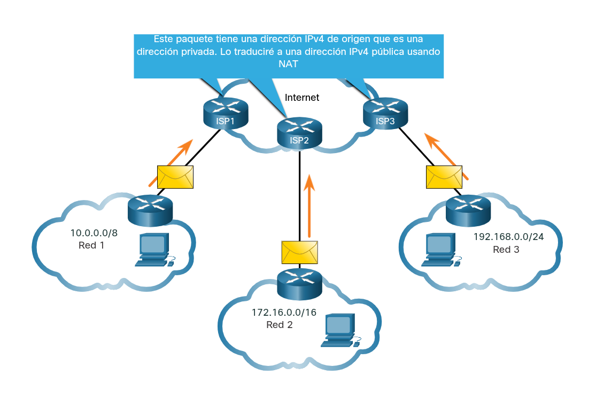

---

#### Direcciones IPv4 publicas y privadas.

**Direcciones Públicas:** Son exclusivas a nivel mundial y están diseñadas para ser **enrutadas globalmente** a través de Internet (entre los routers de los proveedores de servicios - ISP).

**Direcciones Privadas:** Son bloques de direcciones reservados para que las organizaciones los asignen a sus **hosts internos**.

**No son únicas:** Cualquier red en el mundo puede usar los mismos rangos internamente.

**Cero Internet:** Estas direcciones **no** se pueden enrutar hacia Internet (los routers públicos las descartan).

**Origen del concepto:** Se introdujeron en los años 90 como un "parche" temporal debido al **agotamiento rápido** de las direcciones IPv4 públicas.

**La solución real:** A largo plazo, la solución definitiva al agotamiento de direcciones es la transición al protocolo **IPv6**.

**Bloque de direcciones privadas:**

**Nota:** Las direcciones privadas se definen en RFC 1918 y a veces se denomina espacio de direcciones RFC 1918.

----

#### Enrutamiento de internet y NAT:

Las redes internas (intranet) usan direcciones IPv4 privadas, pero estas **no son enrutables globalmente**.

Cuando un host interno envía un paquete fuera de su red, la IP de origen es _privada_ y la IP de destino es _pública_.

Los proveedores de Internet (ISP) bloquean y descartan cualquier paquete que llegue con una IP de origen privada. Por lo tanto, esas direcciones deben **filtrarse o traducirse** antes de enviarse al ISP.

Para permitir que las IPs privadas naveguen en Internet, se utiliza **NAT (Traducción de Direcciones de Red)**, que convierte las direcciones privadas internas en una dirección pública válida antes de que el paquete salga de la red.

**Implementación de NAT y Zona Desmilitarizada (DMZ)**

**El Proceso NAT:** Ocurre típicamente en el **router de borde** (el equipo que conecta la red interna de la organización con la red del ISP).

Su función es interceptar el tráfico de salida y cambiar la dirección IP privada de origen por una pública enrutable.

**Advertencia de Seguridad:** Aunque NAT oculta tus direcciones internas de Internet, el IETF **no lo considera una medida de seguridad efectiva**. No reemplaza a un firewall real.

**Zona Desmilitarizada (DMZ):**

Es una sección de la red diseñada para alojar servicios que el público debe acceder desde Internet (como un servidor web).

A diferencia de la red interna, los equipos en la DMZ utilizan **direcciones IPv4 públicas**.

En esta arquitectura, el router realiza un trabajo triple: enrutamiento normal, traducción NAT (para los usuarios internos) y funciones de **firewall** para proteger tanto la DMZ como la intranet.

.png)

----

**Direcciones IPv4 de uso especial:**

**Direcciones de Loopback**

Las direcciones de loopback, que abarcan el bloque **127.0.0.0/8** (comúnmente representadas por la **127.0.0.1**), son direcciones IPv4 de uso especial que un host utiliza para dirigir el tráfico hacia sí mismo. Su propósito principal es permitirle al equipo probar si su propia configuración interna de TCP/IP está funcionando correctamente. Al utilizar herramientas como el comando `ping` hacia cualquier dirección dentro de este rango, el tráfico nunca sale a la red externa, sino que realiza un bucle invertido y es respondido directamente por el propio host local.

**Direcciones Link-Local (APIPA)**

Las direcciones _link-local_, también conocidas como **APIPA** (Automatic Private IP Addressing), ocupan el bloque **169.254.0.0/16** (rango del `169.254.0.1` al `169.254.255.254`). Estas direcciones son una función de autoconfiguración que utilizan los clientes DHCP, principalmente en sistemas Windows, para asignarse una IP automáticamente cuando no encuentran un servidor DHCP disponible en la red. Aunque técnicamente podrían emplearse en conexiones punto a punto, su uso principal es este mecanismo de respaldo, lo que impide que un host se quede completamente sin conectividad lógica ante una falla en la asignación de direcciones.

---

**Direccionamiento IPv4 con clase:**

|**Clase**|**Rango de Dirección**|**Prefijo**|**Uso / Capacidad**|
|---|---|---|---|
|**A**|`0.0.0.0` - `127.0.0.0`|`/8`|Redes masivas (> 16 millones de hosts)|
|**B**|`128.0.0.0` - `191.255.0.0`|`/16`|Redes medianas a grandes (~ 65,000 hosts)|
|**C**|`192.0.0.0` - `223.255.255.0`|`/24`|Redes pequeñas (máx. 254 hosts)|
|**D**|`224.0.0.0` - `239.0.0.0`|N/A|Reservado para Multidifusión|
|**E**|`240.0.0.0` - `255.0.0.0`|N/A|Reservado para fines experimentales|

**Nota histórica:** Este sistema resultó ineficiente, ya que las clases A y B acaparaban la mayoría de las direcciones disponibles sin llegar a utilizarlas totalmente, lo que provocó un gran desperdicio de espacio de direccionamiento.

---
**Jerarquía de Asignación de Direcciones IP**

La gestión de las direcciones IP (tanto IPv4 como IPv6) sigue una estructura jerárquica global para garantizar que sean únicas y enrutables:

**IANA (Internet Assigned Numbers Authority):** Es la autoridad global encargada de administrar y asignar los grandes bloques de direcciones IP a nivel mundial.

**RIR (Registros Regionales de Internet):** La IANA delega la administración a cinco RIRs, que distribuyen los recursos en sus respectivas regiones geográficas.

**ISP (Proveedores de Servicios de Internet):** Los RIR asignan bloques a los ISPs, quienes son los encargados finales de proporcionar las direcciones IP a las organizaciones y usuarios finales.

**Organizaciones:** Las empresas o entidades reciben sus bloques de direcciones de sus proveedores (ISP) o, dependiendo de sus políticas y tamaño, pueden solicitar bloques de direcciones directamente a un RIR.

---

