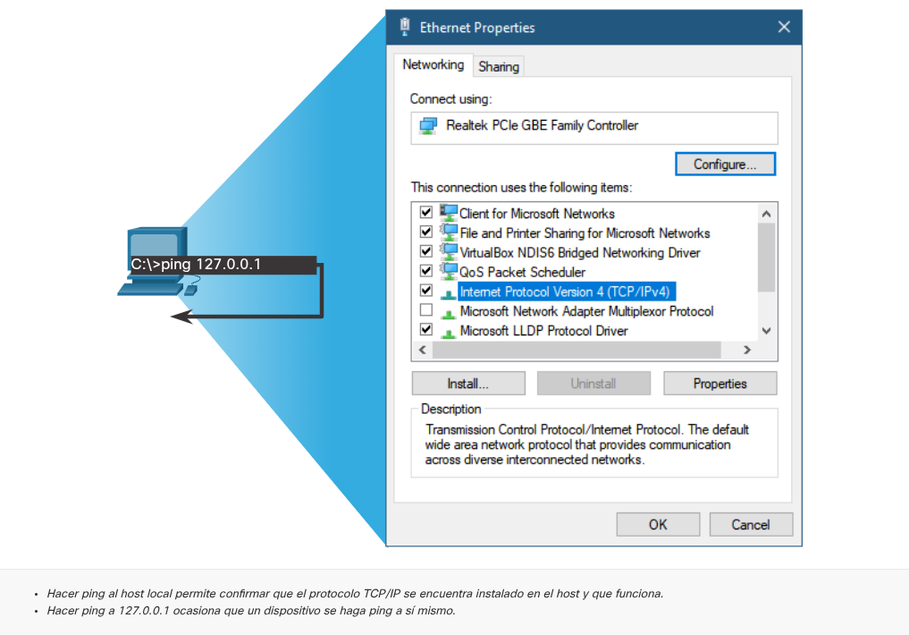

---

El comando **ping** es la utilidad estándar para verificar la conectividad entre hosts en redes IPv4 e IPv6 mediante el intercambio de mensajes **ICMP Echo Request** (solicitud) y **ICMP Echo Reply** (respuesta).

### Puntos clave de funcionamiento:

**Medición de rendimiento:** Calcula el tiempo de ida y vuelta (_Round Trip Time_ o RTT) y proporciona un resumen final con la tasa de éxito (paquetes recibidos vs. enviados).

**Tiempo de espera (_Timeout_):** Si no hay respuesta dentro del límite establecido, el comando informa el fallo. Un _timeout_ puede deberse a problemas reales de red o a políticas de seguridad (firewalls) que bloquean los mensajes ICMP.

**Comportamiento inicial:** Es común que el primer `ping` falle o tarde más porque el dispositivo debe resolver la dirección (ARP en IPv4 o ND en IPv6) antes de enviar el paquete.

---

### Loopback

Hacer _ping_ a la dirección de **loopback** (bucle de retorno) es la primera prueba diagnóstica para verificar que la pila de protocolos TCP/IP esté instalada y operativa en el host local.

**Detalles de la prueba:**

**Direcciones:** `127.0.0.1` para IPv4 o `::1` para IPv6.

**Qué significa una respuesta exitosa:** Confirma que el protocolo IP funciona correctamente en la capa de red del host.

**Alcance limitado:** Es importante entender que esta prueba **no valida** la configuración de direcciones, máscaras, puertas de enlace ni el estado físico de la tarjeta de red (capa de enlace).

> **Nota crítica:** Si recibes un mensaje de error al hacer _ping_ a estas direcciones, significa que la pila TCP/IP está dañada o no está correctamente instalada en el sistema operativo.

---

### Hacer ping al gateway predeterminado

Hacer _ping_ a la **puerta de enlace predeterminada** (_default gateway_) es el siguiente paso lógico para verificar la conectividad operativa dentro de la red local.

### Análisis del flujo de la prueba

**Propósito:** Confirmar que existe comunicación exitosa entre tu host y la interfaz del router que actúa como salida hacia otras redes.

**Si el _ping_ al gateway falla:**

**Prueba alternativa:** Envía un _ping_ a otro host dentro de la misma red local que sepas que está encendido.

**Diagnóstico de escenarios:**

**Si otro host SÍ responde:** El problema es específico de la interfaz del router (podría estar caída, mal configurada o tener políticas de seguridad que bloquean mensajes ICMP).

**Si ningún host responde:** Es probable que el problema sea tu configuración local (dirección IP, máscara, o problemas en la capa física).

**Nota técnica:** Un fallo en el _ping_ al gateway no siempre significa que la red esté caída; a menudo, se debe a una dirección de puerta de enlace configurada incorrectamente en el host o a reglas de seguridad en el router que descartan las solicitudes de eco para evitar el descubrimiento de red.

---

### Hacer ping a un host remoto

Hacer _ping_ a un **host remoto** es la prueba definitiva de conectividad, ya que valida el funcionamiento de toda la ruta de red entre tu dispositivo local y el destino final.

**Implicaciones de una prueba exitosa**

**Confirmación integral:** Si el _ping_ responde, verificas simultáneamente:

La operatividad de tu red local.

El correcto funcionamiento de tu puerta de enlace (router local).

La integridad de las tablas de enrutamiento y la disponibilidad de todos los routers intermedios en la ruta.

La funcionalidad del dispositivo de destino.

> **Nota:** La falta de respuesta en un _ping_ remoto no siempre indica una falla en la red; es una práctica común en entornos corporativos limitar o prohibir los mensajes ICMP mediante firewalls por razones de seguridad.

---

### Traceroute - Prueba el Camino

A diferencia del _ping_ (que solo te dice si hay conexión), **traceroute** es un mapa de diagnóstico. Funciona "engañando" a la red: envía paquetes programados para morir prematuramente usando el campo **TTL (IPv4)** o **Límite de saltos (IPv6)**. Al obligar a que los paquetes caduquen en cada parada, fuerza a los routers a "dar la cara" y revelar su IP mediante mensajes de error, permitiéndote ver exactamente por dónde viajan tus datos y, lo más importante, **en qué router específico se rompe la comunicación**.

**La anatomía del rastreo (Lo que de verdad importa)**

| **Lo que ves / El Concepto** | **El significado real (Lo que está pasando)**                                                                                                                                                  |
| ---------------------------- | ---------------------------------------------------------------------------------------------------------------------------------------------------------------------------------------------- |
| **El "Hack" del TTL**        | Se envía el primer paquete con TTL=1, el segundo con TTL=2, etc. Cada router resta 1. Cuando el TTL llega a 0, el router mata el paquete y tiene la obligación de avisarte.                    |
| **ICMP _Time Exceeded_**     | Es el aviso de muerte del paquete. Gracias a este mensaje de error, tu PC registra la IP de ese router y lo anota como un "salto" en la lista.                                                 |
| **Asterisco ( * )**          | **Silencio.** Significa que el router ignoró tu paquete por seguridad (firewall que bloquea ICMP) o que la red está tan congestionada que el paquete se perdió en el abismo.                   |
| **Tiempos RTT altos**        | **Cuello de botella.** Si ves que un salto pasa de 10ms a 200ms, acabas de encontrar un router sobrecargado o un enlace físico deficiente.                                                     |
| **El Destino Final**         | Sabes que llegaste porque el último equipo **no** devuelve un error de "Tiempo superado", sino que responde normalmente (Echo Reply) o avisa que el puerto está cerrado (Puerto inalcanzable). |
