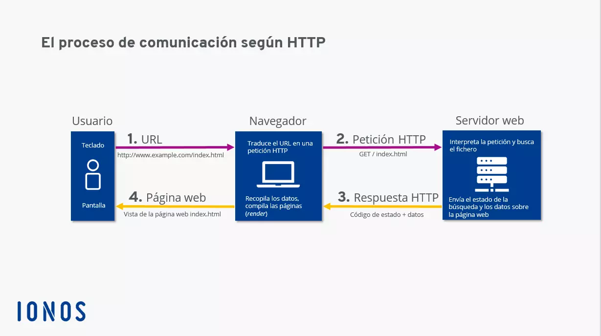
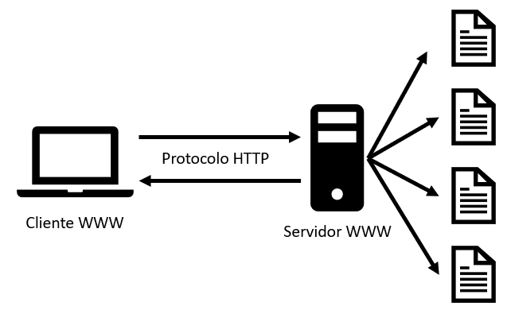
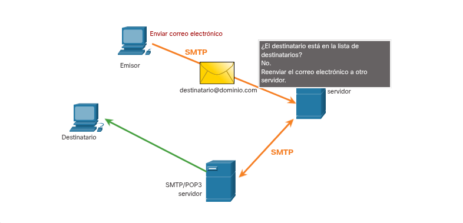
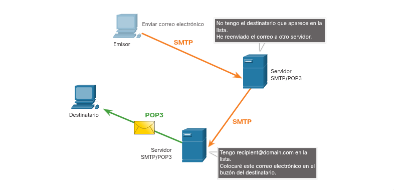
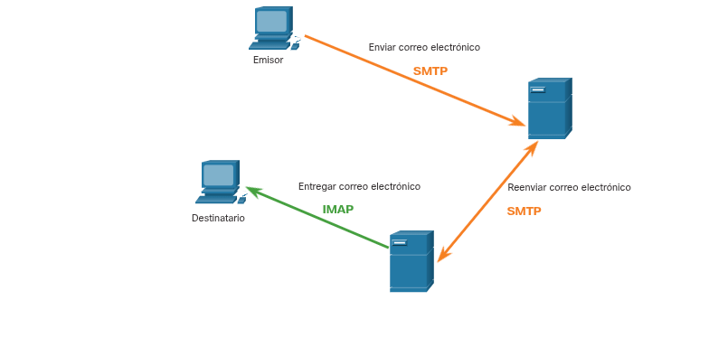

---

### Protocolo de transferencia de hipertexto y lenguaje de marcado de hipertexto

El funcionamiento de la navegación web se basa en un proceso de comunicación estructurado:

**Inicio de la conexión**: Cuando escribes una dirección web (conocida como URL o URI) en tu navegador, este se conecta automáticamente al servidor que aloja el sitio.

**Gestión del protocolo**: El servicio web que se ejecuta en el servidor utiliza el protocolo HTTP para manejar la solicitud.

**Interacción cliente-servidor**: Este protocolo es lo que permite que tu navegador dialogue con el servidor, logrando que la página web se cargue y se muestre en tu pantalla.

---

### HTTP y HTTPS

HTTP es un protocolo de solicitud-respuesta fundamental para la navegación web. Su función es especificar cómo se intercambian los mensajes entre un cliente (como tu navegador) y un servidor web.

### Métodos de comunicación comunes

Para interactuar con el servidor, HTTP utiliza principalmente estos tres mensajes:

**GET**: El cliente solicita datos (por ejemplo, cuando pides cargar una página HTML).

**POST**: Se utiliza para enviar datos al servidor, como la información que rellenas en un formulario.

**PUT**: Se emplea para subir o cargar recursos (como imágenes o archivos) al servidor.

### La diferencia con HTTPS (Seguridad)

Aunque HTTP es muy flexible, tiene una debilidad crítica: **no es seguro**. La información viaja en texto plano, lo que significa que cualquier persona que intercepte el tráfico podría leer tus datos personales.

Aquí entra **HTTPS** (HTTP Seguro) para resolver este problema:

**Protección**: Utiliza autenticación y cifrado para asegurar que los datos no puedan ser leídos por terceros.

**Funcionamiento**: Sigue el mismo proceso de solicitud-respuesta de HTTP, pero añade una capa de seguridad mediante **SSL (Capa de Sockets Seguros)**. Esta capa cifra todo el flujo de datos antes de que sea transportado a través de la red, garantizando la privacidad de la comunicación.

---

### Protocolos de correo electrónico

El correo electrónico es un servicio de "guardado y desvío" donde los mensajes no viajan directamente de un usuario a otro. En cambio, se almacenan en bases de datos dentro de servidores gestionados, generalmente por un ISP (Proveedor de Servicios de Internet).

**Funcionamiento del modelo**

Los clientes de correo (tu PC o smartphone) nunca se comunican directamente con otros clientes. Todo el transporte de mensajes depende de los servidores de correo, que actúan como intermediarios para mover los datos entre dominios.

**Los tres protocolos fundamentales**

Para que este sistema funcione, se utilizan tres protocolos distintos en la capa de aplicación:

**SMTP (Protocolo Simple de Transferencia de Correo):** Es el protocolo utilizado **exclusivamente para enviar** correos electrónicos desde el cliente hacia el servidor, o entre servidores de correo.

**POP (Protocolo de Oficina de Correos):** Se utiliza para **recuperar** mensajes. Por lo general, descarga el correo del servidor al dispositivo local y, a menudo, lo borra del servidor tras la descarga.

**IMAP (Protocolo de Acceso a Mensajes de Internet):** También se utiliza para **recuperar** mensajes, pero de forma más avanzada. Mantiene el correo sincronizado en el servidor, permitiendo acceder a los mensajes desde múltiples dispositivos sin borrarlos automáticamente.

---

---

