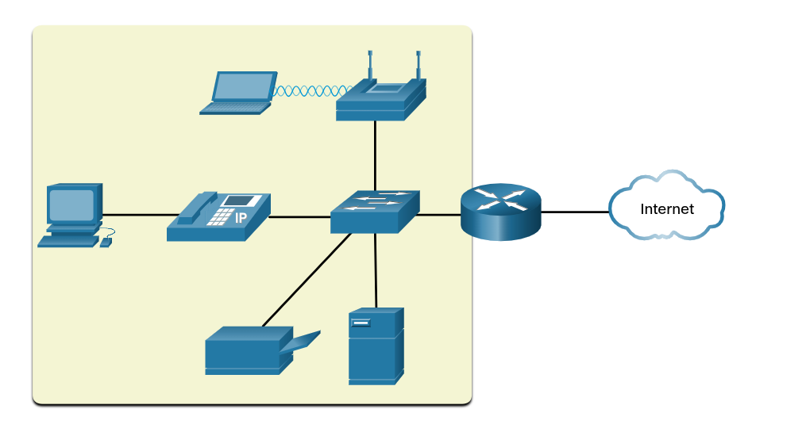
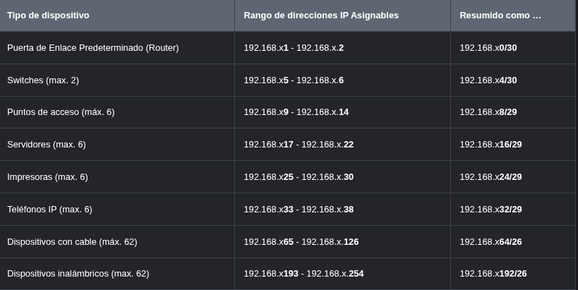
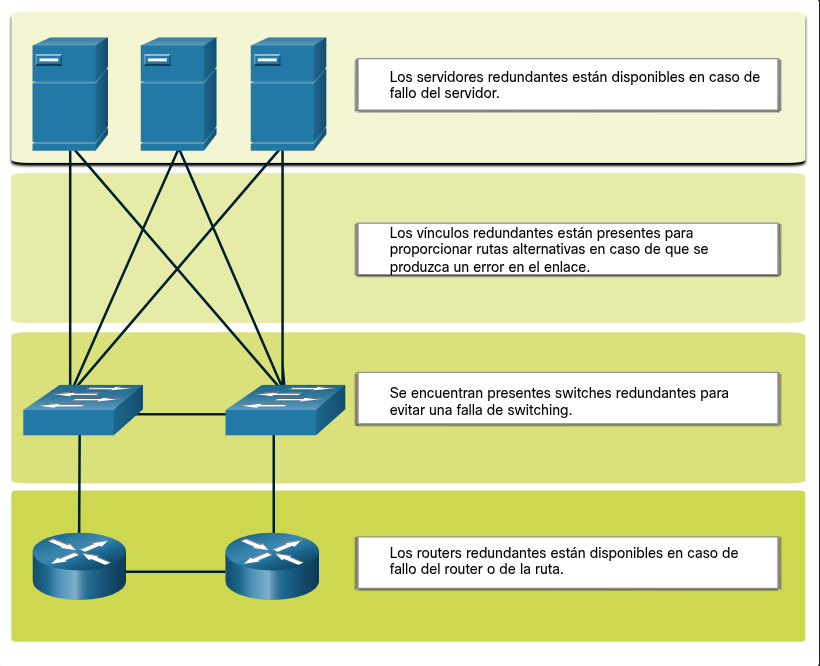

---

**Redes pequeñas:** Utilizan una infraestructura básica (router, switch, punto de acceso) y una única conexión a Internet (DSL, cable o Ethernet) para conectar dispositivos variados (PC, teléfonos IP, impresoras, servidores). Son gestionadas por técnicos locales o externos.

**Redes grandes:** Requieren un departamento de TI especializado debido a su complejidad, aunque los principios de administración son similares a los de una red pequeña.

---

Para la selección de dispositivos en redes pequeñas, los factores clave que debes considerar en tu planificación son:

**Costo:** Incluye no solo el precio de compra inicial, sino también el costo operativo, de mantenimiento y consumo energético a largo plazo.

**Velocidad y tipos de puertos/interfaces:** Debes asegurar que el hardware soporte la velocidad necesaria (ej. Gigabit Ethernet) y cuente con los conectores adecuados para tus dispositivos (fibra, cobre, puertos SFP, PoE para teléfonos o puntos de acceso).

**Capacidad de expansión:** Evalúa si el dispositivo permite añadir más puertos o módulos en el futuro para escalar la red conforme crezca el número de usuarios.

**Características y servicios de los sistemas operativos:** Considera si el dispositivo incluye funciones avanzadas de gestión, seguridad (como VLANs, ACLs, soporte de VPN) y facilidad de configuración a través del sistema operativo del equipo (ej. Cisco IOS).

---

Este esquema de direccionamiento organiza una red mediante **segmentación lógica por tipo de dispositivo**. En lugar de asignar direcciones IP de forma aleatoria, se divide el rango de cada subred (por ejemplo, `192.168.x.0/24`) en bloques específicos para facilitar la administración.

### Puntos clave del diseño:

**Estandarización:** Cada categoría (routers, switches, servidores, usuarios, etc.) tiene un bloque de direcciones reservado. Esto permite que, al ver una IP, sepas inmediatamente qué tipo de dispositivo es.

**Simplificación administrativa:** Al colocar los grupos en límites de subred precisos, es posible aplicar políticas de red o crear "resúmenes" de rutas (agregación) para identificar fácilmente todos los dispositivos de una misma categoría.

**Escalabilidad:** Deja espacio suficiente dentro de cada bloque para futuras adiciones de dispositivos sin romper el esquema ni causar conflictos de solapamiento.

En resumen, este método convierte un espacio de direcciones plano en una **estructura jerárquica y predictiva**, lo que agiliza drásticamente las tareas de monitoreo, seguridad y resolución de problemas.

---

La **redundancia** es esencial en el diseño de redes, incluso para pequeñas empresas, para asegurar la **confiabilidad** y evitar fallos costosos por la pérdida de conectividad.

**Eliminación de puntos únicos de error:** El objetivo es evitar que una sola falla deje a toda la organización sin operación comercial.

**Formas de implementar redundancia:**

**Equipos duplicados:** Instalar hardware adicional en paralelo.

**Enlaces de red duplicados:** Crear caminos alternativos para el tráfico de datos en zonas críticas.

**Estrategia de Internet:** Dado que muchas redes pequeñas dependen de un único router, se recomienda contratar a un segundo proveedor de servicios (ISP) como respaldo para mantener la conexión activa si el gateway principal falla.

---

La administración del tráfico en redes pequeñas busca maximizar la productividad y minimizar la inactividad mediante la implementación de políticas de **Calidad de Servicio (QoS)**, las cuales clasifican y priorizan el flujo de datos según su importancia. Dado que el tráfico en tiempo real, como la voz (VoIP) y el vídeo, es altamente sensible a la latencia, los routers y switches deben configurarse para gestionar estos servicios de forma independiente y preferente frente al tráfico de datos convencional, garantizando así la fluidez de las comunicaciones críticas incluso bajo condiciones de alta carga.

----

