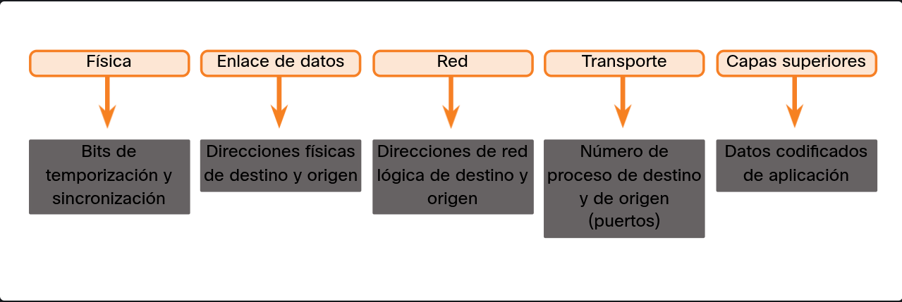
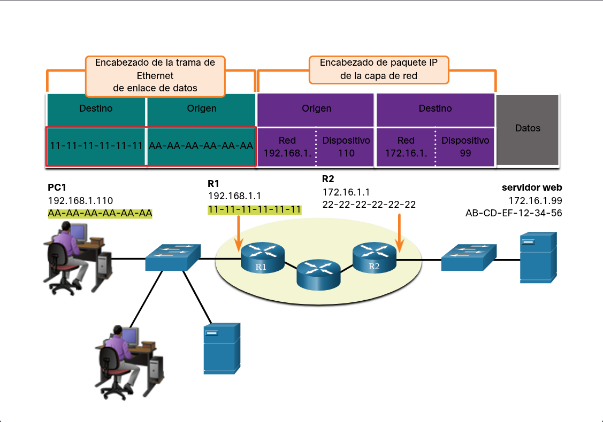

### Direcciónes:

Para que tus datos lleguen a su destino, necesitan **direcciones** en dos niveles: las de la **capa de red** (como la IP) sirven para identificar el origen y el destino final sin importar qué tan lejos estén, mientras que las de la **capa de enlace de datos** (como la MAC) se encargan de mover la información físicamente de un dispositivo a otro dentro de la misma red local. Piensa en la dirección de red como la dirección postal en un sobre (país/ciudad) y la de enlace como el cartero entregándolo de mano en mano hasta la puerta.

### Dirección lógica de capa 3.

Para que la comunicación sea exitosa, se necesitan dos tipos de identificadores: las **direcciones de red (Capa 3)**, que incluyen la **IP de origen y de destino** para identificar el dispositivo que envía y el que recibe el paquete final, y las **direcciones de la capa de transporte (Capa 4)**, que utilizan los **números de puerto de origen y destino**. Mientras que las IPs se encargan de que el paquete llegue al equipo correcto (el host), los números de puerto son los responsables de entregar esos datos a la **aplicación o servicio específico** (como un navegador web o un chat) que debe procesarlos dentro de ese dispositivo.

La **Capa de Enlace de Datos** se encarga de mover la información físicamente de una tarjeta de red (NIC) a otra, pero **solo dentro de la misma red**. Sus direcciones (como la MAC) funcionan por tramos: la **dirección de origen** identifica a la tarjeta que envía la trama en ese momento y la **dirección de destino** identifica a la tarjeta que la recibe en ese mismo segmento local. Si el mensaje debe salir a otra red, esta dirección irá cambiando en cada "salto" que dé entre routers, a diferencia de la IP que siempre se mantiene igual hasta el final.

### Comunicación en la misma red local (Capa 2)

Cuando dos dispositivos están en la **misma red IP**, la entrega de datos es directa y local. En este escenario, la "trama" (el sobre que envuelve los datos) utiliza las direcciones físicas reales de los dispositivos involucrados: la **MAC de origen** es la del equipo que envía (PC1) y la **MAC de destino** es la dirección física real del equipo que recibe (el servidor). Es como entregar una carta en mano a un vecino que vive en tu mismo edificio; como sabes exactamente dónde está, no necesitas un cartero (router) que saque el mensaje a internet, simplemente lo diriges directamente a su tarjeta de red usando su "nombre físico" (MAC).

| **Característica**   | **Capa 3 (Red)**                                                                | **Capa 2 (Enlace de Datos)**                                                       |
| -------------------- | ------------------------------------------------------------------------------- | ---------------------------------------------------------------------------------- |
| **Identificador**    | Dirección IP (Lógica)                                                           | Dirección MAC (Física)                                                             |
| **Alcance**          | **Extremo a extremo:** Desde el origen inicial hasta el destino final.          | **Salto a salto:** Entre dispositivos conectados directamente (ej. PC a Router).   |
| **Comportamiento**   | **Permanece constante.** Las IPs de origen y destino no cambian en el trayecto. | **Cambia en cada salto.** Se reencapsula con nuevas MACs al pasar por cada router. |
| **Propósito**        | Identificar la ubicación lógica del host en la red global.                      | Identificar la tarjeta de red (NIC) del siguiente dispositivo en el camino.        |
| **Destino (Remoto)** | La dirección IP del **Host Final**.                                             | La dirección MAC del **Default Gateway** (interfaz del router).                    |

### Direccionamiento IP Extremo a Extremo

En una comunicación entre redes distintas, las direcciones **IPv4 de origen y destino** funcionan como las direcciones postales en un sobre: identifican quién envía y quién recibe de forma permanente durante todo el viaje. Mientras que las direcciones MAC cambian en cada salto, las IPs se mantienen **intactas de extremo a extremo**. Los routers utilizan la **porción de red** de la IP de destino (en este caso, la red `172.16.1.x`) para entender que el paquete no está en casa y debe ser encaminado a través de la infraestructura de red hasta llegar al host final.

**Origen:** 192.168.1.110 (No cambia).

**Destino:** 172.16.1.99 (No cambia).

**Dato clave:** La porción de red es la que le dice al sistema: "Ey, esto es una red remota, mándalo al gateway".

---

### El Rol de la MAC en Redes Remotas.

Cuando envías datos a una **red diferente**, tu computadora sabe que no puede entregar el paquete físicamente al destino final. Por eso, el direccionamiento de Capa 2 cambia su objetivo:

**MAC de origen:** Sigue siendo la de tu equipo (**PC1**).

**MAC de destino:** Aquí está el truco: **NO es la del servidor final**, sino la MAC de la interfaz de tu router local (**Default Gateway**).

Es como si quisieras enviar un paquete a otro país; no vas directamente a la casa del destinatario, sino que se lo entregas al mensajero local (el router). Tu PC usa la MAC del router para que el mensaje pueda salir de tu red. Una vez que el router recibe la trama, la descarta, revisa la IP y crea una **nueva trama** con nuevas direcciones MAC para el siguiente tramo del camino.

| **Escenario**         | **Dirección IP (Capa 3)**                  | **Dirección MAC (Capa 2)**    | **¿Cómo llega?**                                       |
| --------------------- | ------------------------------------------ | ----------------------------- | ------------------------------------------------------ |
| **En la misma red**   | **IP del destino final.** No cambia.       | **MAC del destino final.**    | Entrega directa de PC a PC.                            |
| **En una red remota** | **IP del destino final.** No cambia nunca. | **MAC del Router (Gateway).** | El router recibe el paquete y "se encarga" de pasarlo. |

