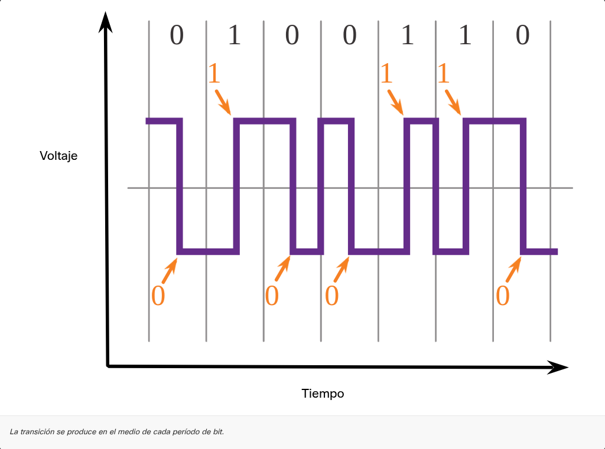

---
### CAPA FISICA. 
Es la base del modelo encargada de transportar los bits de una trama desde el origen al destino a través de medios físicos (cobre, fibra óptica o aire). Su proceso consiste en recibir la trama de la Capa 2, codificarla en señales eléctricas, ópticas o de radio, y transmitirlas; en el receptor, recupera dichas señales, las restaura a su formato binario original y entrega la trama reconstruida a la capa de enlace de datos.

### Estándares de la Capa Física

A diferencia de las capas superiores que se gestionan principalmente mediante software, la capa física depende de hardware y estándares de ingeniería eléctrica.

|Aspecto|Capas Superiores (Aplicación a Transporte)|Capa Física (Capa 1)|
|---|---|---|
|**Implementación**|Software diseñado por ingenieros informáticos.|Circuitos electrónicos, medios y conectores.|
|**Organismo Rector**|IETF (Internet Engineering Task Force).|Organizaciones de ingeniería eléctrica y comunicaciones.|
|**Enfoque**|Servicios y protocolos del conjunto TCP/IP.|Hardware, medios, codificación y señalización.|

### Organizaciones de Estandarización

Estos organismos definen los protocolos que permiten que diferentes dispositivos de red se comuniquen entre sí de manera universal:

|Organización|Sigla|Ámbito de Acción|
|---|---|---|
|**Org. Internacional para la Estandarización**|**ISO**|Estándares globales para múltiples industrias y redes.|
|**Asoc. Industrias de Telecomunicaciones**|**TIA/EIA**|Estándares de cableado y conectores de red.|
|**Unión Internacional de Telecomunicaciones**|**ITU**|Normas para telecomunicaciones internacionales y radio.|
|**Instituto de Ingenieros Eléctricos y Electrónicos**|**IEEE**|Define estándares como Ethernet (802.3) y Wi-Fi (802.11).|
|**Instituto Nacional Estadounidense de Estándares**|**ANSI**|Coordina estándares técnicos en EE. UU. con impacto global.|
|**Comisión Federal de Comunicaciones**|**FCC**|Regulación de frecuencias de radio y comunicaciones en EE. UU.|

---

**Componentes Físicos:** Se trata del "hierro" de la red; básicamente todo el hardware tangible que permite la transmisión de señales. Incluye desde las tarjetas de red (NIC) y los puertos de un router hasta el diseño de los cables, los conectores y la distribución de sus pines. En resumen, son los dispositivos y materiales electrónicos que siguen estándares específicos para asegurar que los bits puedan viajar físicamente de un punto a otro.

---

La **codificación** es simplemente el "lenguaje" o patrón que usamos para que los 0 y 1 sean entendibles al viajar por el cable. En lugar de mandar bits sueltos, se agrupan en patrones predecibles (como el código Morse) para que el emisor y el receptor hablen el mismo idioma.

Un ejemplo clásico es la **codificación Manchester**:

- **0:** El voltaje cambia de alto a bajo.
    
- **1:** El voltaje cambia de bajo a alto.
    

Mientras más rápida es la red (como Gigabit Ethernet), se usan métodos de codificación más avanzados (como 8B/10B) para mover más datos en menos tiempo.

---

La **señalización** es el método físico para convertir los bits en pulsos reales que viajan por el medio. Mientras que la codificación es el idioma o mejor dicho el patrón, la señalización es el grito o el destello de luz:

 **¿Cómo funciona?** Los estándares definen qué cambio físico exacto representa un **1** y qué representa un **0**.

 **Ejemplos:** Puede ser un cambio de voltaje eléctrico, un pulso de luz largo o corto óptico, o variaciones en ondas de radio inalámbrico.

---

 **Cable de Cobre:** Es el medio más común. Transmite datos mediante **impulsos eléctricos**. Es económico y fácil de instalar, pero es sensible a las interferencias electromagnéticas (EMI).
 

 **Cable de Fibra Óptica:** Utiliza **pulsos de luz** para transmitir bits. Se fabrica con vidrio o plástico muy delgado. Es ideal para largas distancias y altas velocidades porque no le afectan las interferencias eléctricas.

 **Medios Inalámbricos:** Transportan señales mediante **ondas de radio** o microondas a través de la atmósfera. No requieren cables físicos, pero la señal puede verse afectada por obstáculos físicos o interferencias de otros dispositivos.

---

El **ancho de banda** es la capacidad de un medio para transportar datos en un tiempo determinado, midiéndose generalmente en kbps, Mbps o Gbps. Es importante no confundirlo con la velocidad de la electricidad la cual es casi constante, ya que la diferencia real radica en el **número de bits enviados por segundo**. Su capacidad práctica depende de una combinación entre las propiedades físicas del medio (cobre, fibra o aire) y las tecnologías utilizadas para la señalización y detección de datos.

---
### Terminología de Medición de Red

| **Concepto**                 | **Definición Sencilla**                                                                            | **De qué depende / Qué lo afecta**                                                                         |
| ---------------------------- | -------------------------------------------------------------------------------------------------- | ---------------------------------------------------------------------------------------------------------- |
| **Latencia**                 | El **tiempo** total incluyendo retrasos que tardan los datos en viajar de un punto A a un punto B. | Cantidad de dispositivos intermedios y congestión en la ruta.                                              |
| **Rendimiento (Throughput)** | La medida **real** de bits transferidos a través de los medios en un periodo dado.                 | El enlace más lento de la ruta (cuello de botella) y la cantidad de tráfico actual.                        |
| **Capacidad Útil (Goodput)** | La medida de **datos utilizables** (reales) que llegan al destino, excluyendo la "basura" técnica. | Se obtiene restando al rendimiento el tráfico de control (encabezados, acuses de recibo, retransmisiones). |

---
